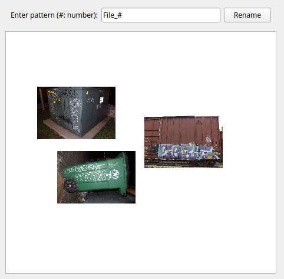

Meet your new friend `patdrag`, they'll help you intuitively rename images according to the position on screen and a pattern of your choice.

## Usage
(you'll need PyQt5: `pip install pyqt5`)

I can't be bothered to make this into a package, so just invoke `patdrag` from the command line as follows:
```bash
$ python patdrag.py <path to folder with images>
```

Now input a pattern and drag the images into your desired order;
when you click "Rename" they'll be renamed according to the pattern starting with
the leftmose image and moving right.

For example, the clicking "Rename" in the following state



would result in the utility box being `File_000.JPG`,
the garbage can being `File_001.JPG`,
and the train car being `File_002.JPG`.

You can try this demo out with the included image files via
```bash
$ python patdrag.py images
```
Look out for the bonus image.


## Limitations
- The only pattern available is numeric, and numbering starts at 0.
  e.g. `File_#` -> `File_000.<proper extension>, File_001.<proper extension>, ...`
- No error checking on the pattern.
- No checking if input files are only images, `patdrag` may attempt to hoover in non-image files at it's own peril.
- Sometimes the rotation of a photo is not right; I'm not sure why and I don't really care.
- The code is horrible and the GUI is ugly as sin (but it works for me and is all I need).


## Comments
- I take no liability for the actions of this program, but if anything goes wrong hopefully you can find your images stashed at `<path to directory with images>/.patdrag`.
- I'm sure this would have been better done as a web app via Javascript and so on, but I hadn't made a GUI is ages... and now I remember why.
